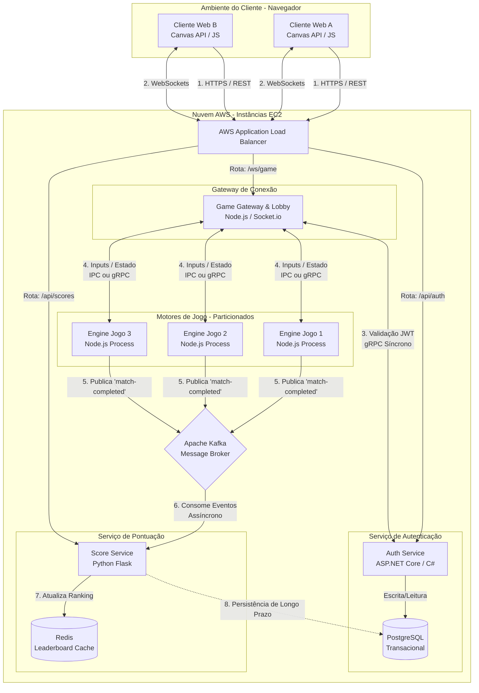

```mermaid
flowchart TD
    %% Definição de Estilo dos Nós
    subgraph Clientes [Ambiente do Cliente - Navegador]
        N1[Cliente Web A<br/>Canvas API / JS]
        N2[Cliente Web B<br/>Canvas API / JS]
    end

    subgraph Infra_AWS [Nuvem AWS - Instâncias EC2]
        LB[AWS Application Load Balancer]

        %% Microsserviço de Autenticação
        subgraph MS_Auth [Serviço de Autenticação]
            Auth[Auth Service<br/>ASP.NET Core / C#]
            DB_User[(PostgreSQL<br/>Transacional)]
        end

        %% Microsserviço de Conexão
        subgraph MS_Gateway [Gateway de Conexão]
            Gateway[Game Gateway & Lobby<br/>Node.js / Socket.io]
        end

        %% Motores de Jogo Particionados
        subgraph MS_Engine [Motores de Jogo - Particionados]
            EngineA[Engine Jogo 1<br/>Node.js Process]
            EngineB[Engine Jogo 2<br/>Node.js Process]
            EngineC[Engine Jogo 3<br/>Node.js Process]
        end

        %% Broker de Eventos
        Broker{Apache Kafka<br/>Message Broker}

        %% Microsserviço de Score
        subgraph MS_Score [Serviço de Pontuação]
            Score[Score Service<br/>Python Flask]
            Cache[(Redis<br/>Leaderboard Cache)]
        end
    end

    %% Fluxos de Comunicação Externa
    N1 -->|1. HTTPS / REST| LB
    N1 <--->|2. WebSockets| LB
    N2 -->|1. HTTPS / REST| LB
    N2 <--->|2. WebSockets| LB

    %% Roteamento do Load Balancer
    LB -->|Rota: /api/auth| Auth
    LB -->|Rota: /ws/game| Gateway

    %% Fluxos Internos Síncronos (REST / gRPC)
    Auth -->|Escrita/Leitura| DB_User
    Gateway <-->|3. Validação JWT<br/>gRPC Síncrono| Auth

    %% Roteamento Interno de Partidas
    Gateway <--->|4. Inputs / Estado<br/>IPC ou gRPC| EngineA
    Gateway <--->|4. Inputs / Estado<br/>IPC ou gRPC| EngineB
    Gateway <--->|4. Inputs / Estado<br/>IPC ou gRPC| EngineC

    %% Fluxo Assíncrono Orientado a Eventos
    EngineA -->|5. Publica 'match-completed'| Broker
    EngineB -->|5. Publica 'match-completed'| Broker
    EngineC -->|5. Publica 'match-completed'| Broker

    %% Processamento em Background
    Broker -->|6. Consome Eventos<br/>Assíncrono| Score
    Score -->|7. Atualiza Ranking| Cache
    Score -.->|8. Persistência de Longo Prazo| DB_User
    LB -->|Rota: /api/scores| Score
```