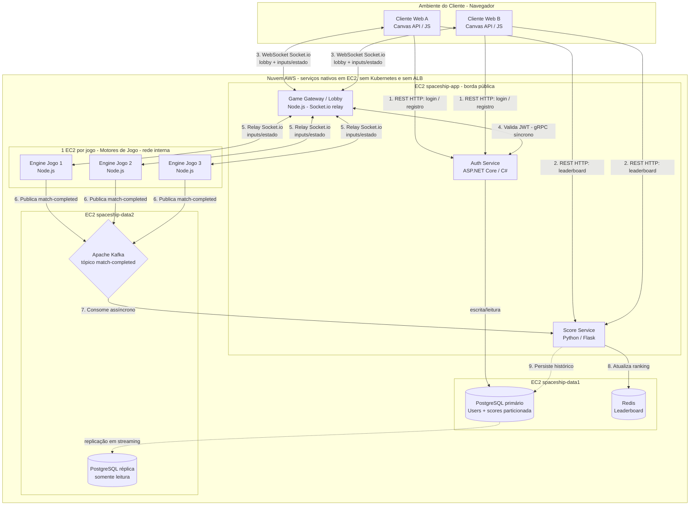

# Arquitetura do Spaceship (diagrama)

Diagrama dos serviços e dos **três paradigmas de comunicação** (cliente-servidor,
RPC síncrono e pub-sub/messaging). O agrupamento em caixas reflete a topologia real
do deploy AWS (6 EC2, **sem Kubernetes e sem ALB**); o detalhe de cada serviço está
em [descrição da arquitetura.md](descri%C3%A7%C3%A3o%20da%20arquitetura.md) e o passo a
passo de execução no [README na raiz](../../README.md).

## Legenda dos fluxos

| # | Origem → Destino | Protocolo / paradigma | Para quê |
|---|---|---|---|
| 1 | Navegador → Auth | REST/HTTP (cliente-servidor, síncrono) | Login e registro |
| 2 | Navegador → Score | REST/HTTP (cliente-servidor, síncrono) | Ler o ranking global |
| 3 | Navegador ↔ Gateway | WebSocket / Socket.io (cliente-servidor) | Lobby e **jogo em tempo real** (inputs + estado por tick) |
| 4 | Gateway ↔ Auth | **gRPC síncrono** (bloqueante) | Validar a sessão (JWT + revogação) na conexão |
| 5 | Gateway ↔ Engines | Socket.io (**relay**, rede interna) | Repassar inputs ao engine da sala e o estado de volta |
| 6 | Engines → Kafka | **Publish** (assíncrono) | Publicar `match-completed` ao fim da partida |
| 7 | Kafka → Score | **Subscribe / messaging** (assíncrono) | Consumir o resultado e materializar o ranking |
| 8 | Score → Redis | comando | Ranking por minijogo (sorted set) |
| 9 | Score → PostgreSQL | persistência | Histórico (`scores` particionada por minijogo) |

> **Sem WebRTC e sem ALB.** O canal de jogo em tempo real é **WebSocket (Socket.io)**:
> o cliente fala **só com o gateway**, que faz **relay** para o engine dono da sala
> (cada jogo no seu processo/EC2 = **particionamento funcional**). O balanceamento das
> partidas é o **matchmaking do gateway** (escolhe o engine por jogo), não um load balancer.
