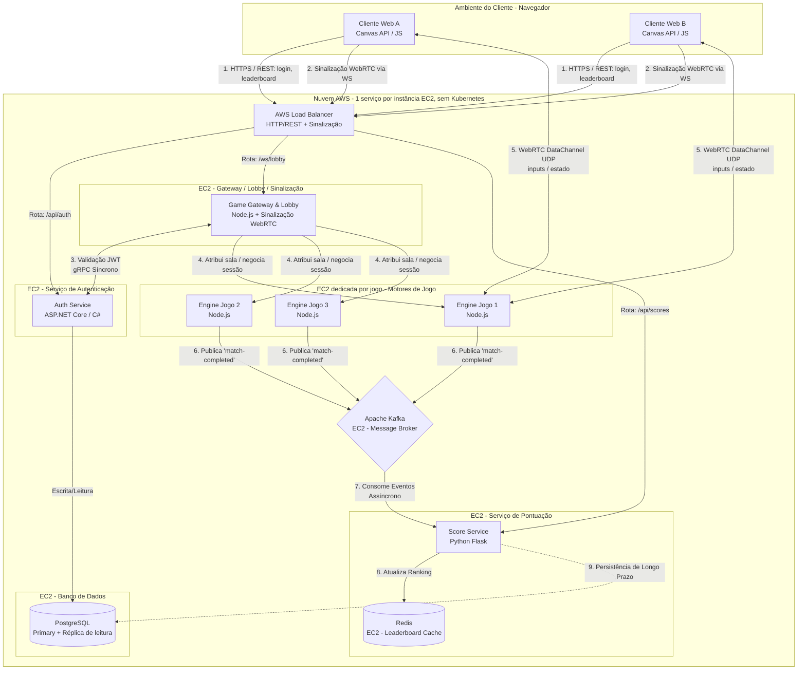

```mermaid
flowchart TD
    %% Definição de Estilo dos Nós
    subgraph Clientes [Ambiente do Cliente - Navegador]
        N1[Cliente Web A<br/>Canvas API / JS]
        N2[Cliente Web B<br/>Canvas API / JS]
    end

    subgraph Infra_AWS [Nuvem AWS - 1 serviço por instância EC2, sem Kubernetes]
        LB[AWS Load Balancer<br/>HTTP/REST + Sinalização]

        %% Microsserviço de Autenticação
        subgraph MS_Auth [EC2 - Serviço de Autenticação]
            Auth[Auth Service<br/>ASP.NET Core / C#]
        end

        %% Banco de dados
        subgraph MS_DB [EC2 - Banco de Dados]
            DB_User[(PostgreSQL<br/>Primary + Réplica de leitura)]
        end

        %% Microsserviço de Conexão / Sinalização
        subgraph MS_Gateway [EC2 - Gateway / Lobby / Sinalização]
            Gateway[Game Gateway & Lobby<br/>Node.js + Sinalização WebRTC]
        end

        %% Motores de Jogo Particionados - 1 EC2 por jogo
        subgraph MS_Engine [EC2 dedicada por jogo - Motores de Jogo]
            EngineA[Engine Jogo 1<br/>Node.js]
            EngineB[Engine Jogo 2<br/>Node.js]
            EngineC[Engine Jogo 3<br/>Node.js]
        end

        %% Broker de Eventos
        Broker{Apache Kafka<br/>EC2 - Message Broker}

        %% Microsserviço de Score
        subgraph MS_Score [EC2 - Serviço de Pontuação]
            Score[Score Service<br/>Python Flask]
            Cache[(Redis<br/>EC2 - Leaderboard Cache)]
        end
    end

    %% REST e sinalização passam pelo Load Balancer
    N1 -->|1. HTTPS / REST: login, leaderboard| LB
    N2 -->|1. HTTPS / REST: login, leaderboard| LB
    N1 -->|2. Sinalização WebRTC via WS| LB
    N2 -->|2. Sinalização WebRTC via WS| LB

    %% Roteamento do Load Balancer
    LB -->|Rota: /api/auth| Auth
    LB -->|Rota: /ws/lobby| Gateway
    LB -->|Rota: /api/scores| Score

    %% Fluxos Internos Síncronos
    Auth -->|Escrita/Leitura| DB_User
    Gateway <-->|3. Validação JWT<br/>gRPC Síncrono| Auth

    %% Matchmaking: o Gateway atribui a sala a um Engine e negocia a sessão WebRTC
    Gateway -->|4. Atribui sala / negocia sessão| EngineA
    Gateway -->|4. Atribui sala / negocia sessão| EngineB
    Gateway -->|4. Atribui sala / negocia sessão| EngineC

    %% Fluxo de jogo em tempo real: WebRTC DataChannel DIRETO cliente <-> engine
    N1 <-->|5. WebRTC DataChannel UDP<br/>inputs / estado| EngineA
    N2 <-->|5. WebRTC DataChannel UDP<br/>inputs / estado| EngineA

    %% Fluxo Assíncrono Orientado a Eventos
    EngineA -->|6. Publica 'match-completed'| Broker
    EngineB -->|6. Publica 'match-completed'| Broker
    EngineC -->|6. Publica 'match-completed'| Broker

    %% Processamento em Background
    Broker -->|7. Consome Eventos<br/>Assíncrono| Score
    Score -->|8. Atualiza Ranking| Cache
    Score -.->|9. Persistência de Longo Prazo| DB_User
```
